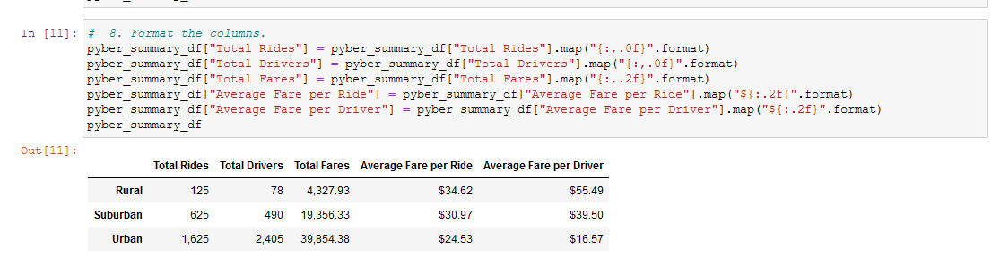
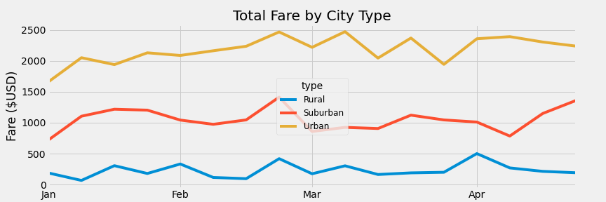

# Module 5: PyBer with Matplotlib
## This Analysis is built with the purpose of drawing conclusions from the differences in metrics based on City Type; being Urban, Suburban and Rural.
Relevant metrics include: Total Rides, Total Drivers, Total Fares, Average Fare per Ride, and Average Fare per Driver.
As you can see from the results of the Analysis, trends are clearly visible.

## Summarizing, we can state that Urban areas (ostensibly more populated), have vastly (more than 10x) more total ride and total Drivers (30x) than Rural.
Roughly lying between these 2 are Suburban areas.
Additionally, a trend (Urban/Suburban/Rural) can be seen in the Average Fare per ride ($24<$31<$35) and Average Fare per Driver ($17<$40<$55) where it seems either supply/demand or Competition (Total Drivers) creates an upward or downward pressure on prices.
The following Line Chart shows these differences as well as showcasing variances based on time of year (expressed as weekly aggregates). I would hesitate to try and make conclusions about business based on time of year for this analysis.

## Based on these results, it would seem prudent to add more drivers to Rural areas. There may be customers wanting rides but not enough drivers to provide them. This could be the cause of high fares, as drivers may be deliberately trying to drive demand down.

A slightly different option would be to make into policy lower fares, this could increase the demand, which could then be answered with more drivers.

In addition to either of these suggestions, a deeper analysis could be done based on more data collecting to then refine and ascertain if time of year affects business, as these don’t seem to have a strong story to tell for this analysis, nor are there any causes of seasonal variances visible (does the number of drivers/cars change throughout the year?  Does either weather or climate have an effect?).

As a foot note: Distance Traveled is not a data metric gathered, and if collected could allow more conclusions to be drawn about fare price for Rural areas.
